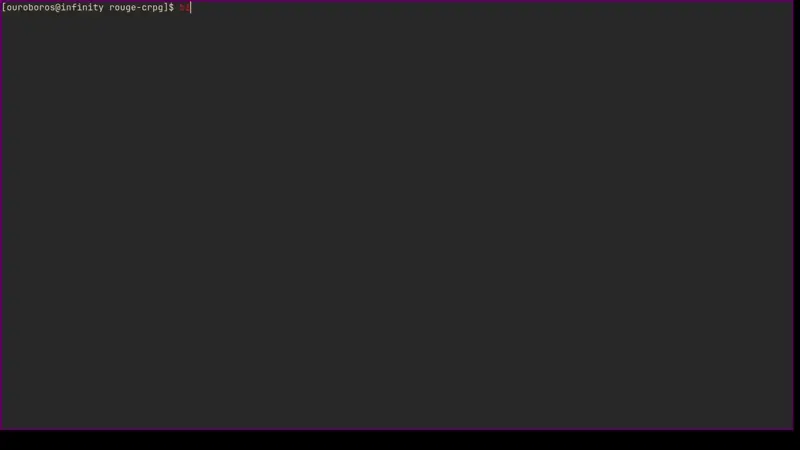

# rouge-crpg

A rouge-like game creator written in C
<br>
The eventual goal is to be able to build a simple rouge like game using this project

## Screenshots



## Setup

- Run ```make``` command to compile the project
- Run ```make clean``` to remove all object and compiled files
- Run ```bin/rouge``` to run the program

## Directory structure

- src: contains code files
- include: contains header files
- obj: object files that are created
- bin: compiled program is stored here

## To-Do

- [x] Create player
- [x] Player movement
  - [x] Input Handling
  - [x] Legal movements only
- [ ] scrollable maps (maps that are larger than the screen have visible parts rendered)
- [ ] Obstacles
- [ ] Puzzles
- [ ] Levels 
- [ ] Stats
- [ ] Resources
- [ ] Enemies
- [ ] Random levels

Further additions can be taken from the original [Rouge game](https://en.wikipedia.org/wiki/Rogue_(video_game)) 
